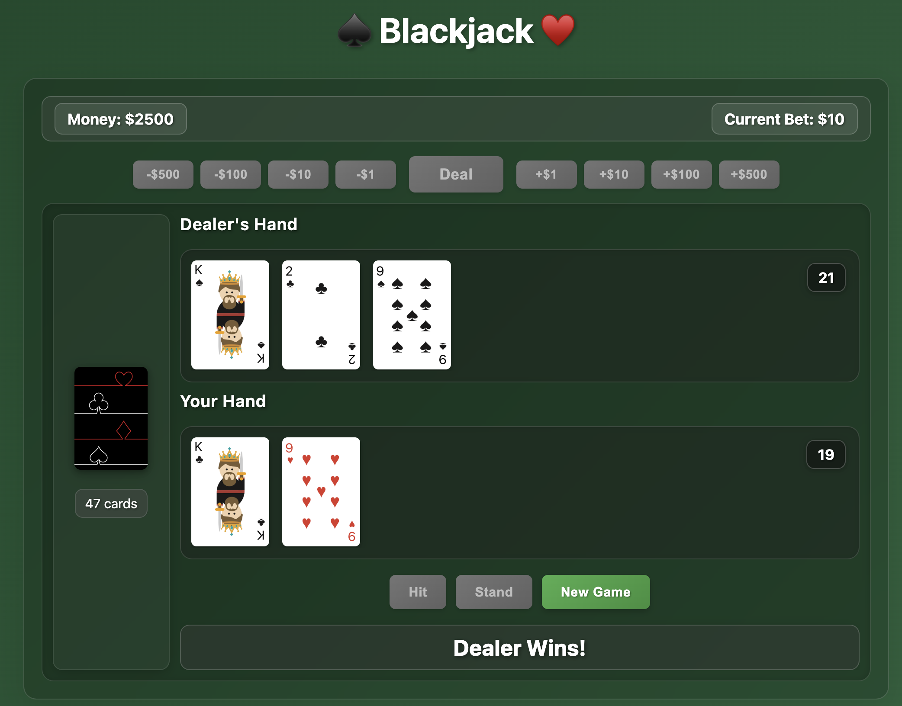

# 🎮  Blackjack

A classic Blackjack card game built with HTML, CSS, and JavaScript. Experience casino-style gameplay with smooth animations, realistic card interactions.

## 🎯 How to Play

1. **Starting the Game**
   - Begin with $2,500 in chips
   - Place your bet using the betting controls ($1 to $500)
   - Click "Deal" to start the hand

2. **Game Rules**
   - Try to beat the dealer by getting closer to 21 without going over
   - Card Values:
     - Number cards (2-10): Face value
     - Face cards (J, Q, K): 10 points
     - Aces: 1 or 11 (automatically optimized)
   - Dealer must hit on 16 and stand on 17
   - Blackjack pays 3:2

3. **Player Actions**
   - Hit: Take another card
   - Stand: Keep current hand
   - New Game: Start a fresh hand